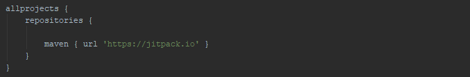
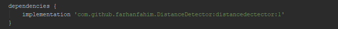
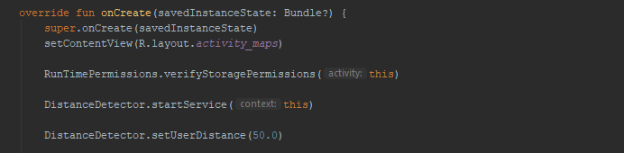
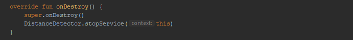

# DistanceDetector

Distance Detector is an android library written in kotlin - This library provides you current latitude, longitude and distance updates and also Alerts you when you out of your given radius.

## How to Use

First you will have to add the library in your android projects. The library is available at jCenter and can be added by putting this line in your app’s build.gradle file.

Add dependencies

Add the permissions in your manifest file

Add these lines in your onCreate Method

OPTIONAL METHODS IF YOU WANT TO GET LATITUDE & LONGITUDE 

Final Step is stop the service in onDestroy method

Distance Detector works just like a Speedometer the difference is speedometer detect our speed, Distance detector detect your distance

DistanceDetector will show your current location marker and draw a radius on map.

## Give it a shot!

The concept of DISTANCE DETECTOR Library is simple, create library rather than write code again and again on difference projects
I hope you love it as much as we do — can’t wait to hear your feedback!

